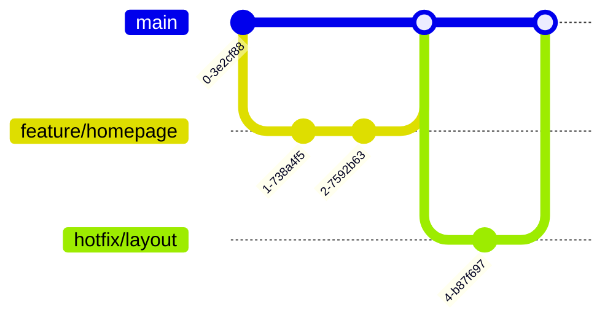

# 🍳 RecipeRally - Collaborative Cooking Platform

**NOT ACCEPTING COMMITS FROM OUTSIDERS**

## 🚀 Live Demo
~~https://yourusername.github.io/reciperally/~~

## 📖 Table of Contents
- [Features](#-features)
- [Tech Stack](#-tech-stack)
- [Quick Start](#-quick-start)
- [Development](#-development)
- [Contributing](#-contributing)

## 🌟 Features
### Core Functionality
- **Recipe Flex System**
  - Responsive 3-column layout
  - Filter by cooking time/ingredients <!--Not Confirmed-->
  - Lazy-loading images

```html
<!-- Sample Recipe Card -->
<article class="recipe-card">
  <header class="recipe-header">
    <h3>Quick Pancakes</h3>
    <div class="cook-time">20 mins</div>
  </header>
  <ul class="ingredients">
    <li>Flour</li>
    <li>Milk</li>
  </ul>
</article>
```

### Interactive Components

## 🛠 Tech Stack
| Category       | Technologies               |
|----------------|----------------------------|
| **Frontend**   | HTML5, CSS, (PHP, optional)|
| **Styling**    | Flexbox, Variables         |
| **Services**   | GitHub Pages, Netlify Forms|
| **Tooling**    | Any IDE (E.g., VSCODE)     |

## ⚡ Quick Start
1. Clone repository:
   ```bash
   git clone https://github.com/GusmonVious/RecipeRally.git
   cd reciperally
   ```

## 🧑💻 Development
### Branch Strategy


## 🤝 Contributing
Follow our Contribution Guideliness:
1. Create feature branch
2. Add tests for new features
3. Submit PR with:
   - Description of changes
   - Screenshots (if UI-related)
   - Affected components list


## 📄 License
MIT License - see [LICENSE](LICENSE) for details